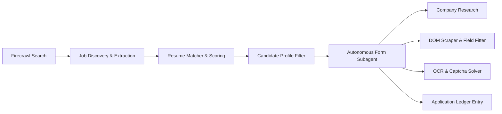

# 🤖 Autopilot — AI Automation Agent & Local LLM API

<div align="center">

[](https://nodejs.org)
[](https://expressjs.com)
[](https://react.dev)
[](https://vitejs.dev)
[](https://playwright.dev)
[](https://www.docker.com)
[](LICENSE)

**An autonomous AI agent and OpenAI-compatible LLM gateway powered by real browser sessions.**  
Automates **ChatGPT, Grok, Gemini, Perplexity, and DeepSeek** with **zero API key fees** — drives your logged-in browser sessions directly through high-performance automation.

[Key Features](#-key-features) •
[Quick Start](#-quick-start) •
[Local LLM API](#-local-llm-api-openai-compatible) •
[Web Dashboard](#-web-dashboard--remote-gui) •
[CLI Console](#-cli-interactive-console) •
[Architecture](#-architecture) •
[Deployment](#-deployment-docker-render-ec2)

---

</div>

## 🌟 Overview

**Autopilot** transforms your existing consumer web accounts (ChatGPT, Grok, Gemini, Perplexity, DeepSeek) into:

1. 🔌 **A standard OpenAI-compatible REST API** (`/v1/chat/completions`, `/v1/models`, `/v1/completions`) usable in Python, Node.js, LangChain, Cursor, Chatbox, or any AI client without paying for token fees.
2. 💼 **An AI Job Finder & Auto-Apply Engine** that crawls live listings with **Firecrawl**, matches roles against your resume profile (`profile.json`), and autonomously fills and submits multi-page job applications.
3. 🌐 **An Autonomous Web Subagent ("Bowser")** capable of natural-language browser navigation, scraping, form execution, and data extraction with adaptive self-healing element relocation and ad/tracker blocking.
4. 🧠 **An AI Council (`/council`)** that broadcasts questions concurrently to multiple AI providers and synthesizes their consensus into a single comprehensive answer.
5. 🛡️ **Universal Anti-Bot & Cloudflare Solver (`/solve`)** that automates Turnstile challenge bypasses with stealth mouse physics and humanized interactions.
6. 🖥️ **Fullstack React SPA + Remote noVNC GUI** providing a dashboard, real-time Socket.IO logs, API playground, session management, and live browser streaming on virtual displays (`:99`).

---

## ⚡ Feature Matrix

| Feature | Description | Interfaces |
|---|---|---|
| **Local LLM API** | Drop-in OpenAI-compatible API (`/v1/chat/completions`, `/v1/models`) supporting streaming (SSE), multi-turn session pooling, and optional API key security. | REST API, SDKs, Web Playground |
| **Job Finder** | Search jobs using Firecrawl, calculate resume compatibility scores, filter by CTC/experience/location, and trigger auto-apply workflows. | Web UI, REST (`/api/jobs/*`) |
| **Auto-Apply Engine** | 20+ step autonomous form filler with DOM scraping, company research, OCR/captcha resolution, and application ledger tracking. | CLI (`/apply`), Web UI, REST |
| **Browser Subagent ("Bowser")** | Natural-language web worker with Scrapling-inspired adaptive element relocation, ad/tracker filtering, and Indirect Prompt Injection (IDPI) defense. | CLI (`/browser`), Web UI, REST |
| **Multi-Provider Council** | Query ChatGPT, Grok, Gemini, Perplexity, and DeepSeek in parallel and synthesize unified responses. | CLI (`/council`), Web UI, REST |
| **Anti-Bot & Turnstile Solver** | Automatic Cloudflare Turnstile, interstitial, and challenge detection & solving with humanized coordinate clicks. | CLI (`test_solver.js`), REST (`/v1/solve`) |
| **Dual Engine Strategy** | Run with isolated, headless-capable **Playwright** or connect directly to **Real Browsers (Chrome, Brave, Opera via CDP)** for existing logins & extensions. | Settings, CLI flags, Config |
| **Remote Browser GUI (noVNC)** | Stream the headful virtual display buffer (`Xvfb`) over WebSockets to `/novnc/vnc.html` for headless VPS/Docker setups. | Web Browser |
| **Session Cloud Hydration** | Export minified Base64 sessions (`npm run export-sessions`) to deploy to cloud providers (Render, EC2, Railway) with zero interactive logins. | CLI, Web UI, Env Vars |

---

## 🚀 Quick Start

### Prerequisites
- **Node.js**: v18.0.0 or higher
- **npm**: v9.0.0 or higher
- **Chromium / Playwright**: Installed automatically via npx

### 1. Installation

Clone the repository and install all dependencies (root, backend, and frontend):

```bash
# Clone the repository
git clone https://github.com/VaidikRokad123/API-BOT.git
cd API-BOT

# Install all dependencies across root, backend, and frontend
npm install
npm run install:all

# Download Chromium browser binaries for Playwright
npx playwright install chromium
```

### 2. Configure Environment

Copy the example environment files for both backend and frontend:

**On Windows (PowerShell):**
```powershell
copy backend\.env.example backend\.env
copy frontend\.env.example frontend\.env
```

**On Linux / macOS:**
```bash
cp backend/.env.example backend/.env
cp frontend/.env.example frontend/.env
```

Edit `backend/.env` with your desired configuration (e.g. `PORT=3000`, `LLM_API_KEY`, optional `FIRECRAWL_API_KEY` for Job Finder, optional `MONGODB_URI`).

### 3. Setup Candidate Profile (Optional for Job Auto-Apply)

```powershell
copy backend\data\profile.example.json backend\data\profile.json
```

Open `backend/data/profile.json` and fill in your name, contact details, experience, skills, and resume path.

### 4. Run the Application

You can run Autopilot in three different modes:

#### Option A: Fullstack Web App (Backend API + React Frontend)
```bash
# Run backend (port 3000) and frontend Vite dev server (port 5000) concurrently
npm run dev
```
Open **`http://localhost:5000`** in your browser (proxies API calls to `http://localhost:3000`).

#### Option B: Standalone Production Server
```bash
# Build React frontend bundle and start the unified Express server
npm run build:frontend
npm start
```
Open **`http://localhost:3000`** in your browser.

#### Option C: Interactive Terminal CLI (REPL)
```bash
npm run agent
# or: node backend/agent.js
```

---

## 🔌 Local LLM API (OpenAI Compatible)

The backend provides a drop-in replacement for the OpenAI API at `http://localhost:3000/v1` (or your cloud URL).

### Endpoints

| Method | Endpoint | Description |
|---|---|---|
| `GET` | `/v1/models` | List all supported providers (`chatgpt`, `grok`, `gemini`, `perplexity`, `deepseek`) and login statuses. |
| `POST` | `/v1/chat/completions` | Create a chat completion (supports `messages`, `model`, `stream: true`, `session_id`). |
| `POST` | `/v1/completions` | Legacy prompt completion endpoint. |
| `POST` | `/v1/solve` | Universal anti-bot / Cloudflare Turnstile solver endpoint. |

### 1. Python Integration (`openai` SDK)

```python
from openai import OpenAI

# Point client to your local or deployed Autopilot server
client = OpenAI(
    base_url="http://localhost:3000/v1",
    api_key="local"  # Or your LLM_API_KEY if configured in backend/.env
)

response = client.chat.completions.create(
    model="chatgpt",  # Options: "chatgpt", "grok", "gemini", "perplexity", "deepseek"
    messages=[
        {"role": "system", "content": "You are an expert fullstack software engineer."},
        {"role": "user", "content": "Explain how React Server Components work in 3 concise bullet points."}
    ]
)

print(response.choices[0].message.content)
```

#### Streaming Responses in Python:
```python
stream = client.chat.completions.create(
    model="deepseek",
    messages=[{"role": "user", "content": "Write a Python script for web scraping."}],
    stream=True
)

for chunk in stream:
    if chunk.choices[0].delta.content:
        print(chunk.choices[0].delta.content, end="", flush=True)
```

---

### 2. Node.js / JavaScript Integration (`openai` npm package)

```javascript
import OpenAI from 'openai';

const openai = new OpenAI({
  baseURL: 'http://localhost:3000/v1',
  apiKey: process.env.LLM_API_KEY || 'local',
});

async function run() {
  const completion = await openai.chat.completions.create({
    model: 'grok', // "chatgpt" | "grok" | "gemini" | "perplexity" | "deepseek"
    messages: [
      { role: 'user', content: 'What are the main advantages of using Vite over Webpack?' }
    ],
  });

  console.log(completion.choices[0].message.content);
}

run();
```

---

### 3. cURL Request

```bash
curl -X POST http://localhost:3000/v1/chat/completions \
  -H "Content-Type: application/json" \
  -H "Authorization: Bearer local" \
  -d '{
    "model": "gemini",
    "messages": [
      {"role": "user", "content": "Hello! Give me a creative tech startup idea."}
    ]
  }'
```

---

### 4. Multi-Turn Session Pooling (`session_id`)

Autopilot includes warm browser session pooling. Pass `session_id` to maintain conversation state in the same browser tab without starting fresh:

```bash
# Turn 1:
curl -X POST http://localhost:3000/v1/chat/completions \
  -H "Content-Type: application/json" \
  -d '{
    "model": "chatgpt",
    "session_id": "user-session-42",
    "messages": [{"role": "user", "content": "My name is Alice and I love Rust."}]
  }'

# Turn 2 (context preserved in browser):
curl -X POST http://localhost:3000/v1/chat/completions \
  -H "Content-Type: application/json" \
  -d '{
    "model": "chatgpt",
    "session_id": "user-session-42",
    "messages": [{"role": "user", "content": "What is my name and favorite language?"}]
  }'
```

---

## 💼 AI Job Finder & Automated Application

Autopilot features a dedicated end-to-end recruitment agent:



1. **Job Search via Firecrawl**: Automatically crawls job boards and company career sites using keyword queries, roles, experience filters, and location constraints.
2. **Resume Scoring Algorithm**: Compares the live job description against `backend/data/profile.json` (skills, expected CTC, years of experience, current role) and outputs a match rating (0–100%).
3. **Autonomous Application Pipeline (`/apply`)**:
   - **Research Phase**: Performs pre-application analysis of the target company and role.
   - **Multi-Step Form Filling**: Iterates through application pages (up to 40 steps), filling text inputs, dropdowns, radio buttons, file uploads (PDF resume), and custom canvas signature drawing.
   - **Ledger Verification**: Avoids applying twice to the same listing using the SQLite/MongoDB application ledger (`backend/data/applications.sqlite`).

---

## 🌐 Bowser: Autonomous Browser Subagent

The autonomous subagent (`backend/src/subagent/`) executes complex web tasks described in plain English:

- **Adaptive Element Relocation**: Uses similarity scoring algorithms (ported from Scrapling) to relocate changed or mutated DOM elements during multi-step runs.
- **Ad & Tracker Blocker**: Blocks 3,500+ tracking and advertising domains to speed up page loads and prevent modal noise.
- **Indirect Prompt Injection Defense (IDPI)**: Scans page content before parsing to detect and neutralize adversarial prompt injection payloads hidden in web text.
- **FSM Application Flow**: Finite state machine ensures robust transitions between discovery, form filling, verification, and submission.
- **Domain Skills Auto-Learning**: Records successful interaction heuristics for specific domains to speed up subsequent runs.

---

## 🛡️ Anti-Bot & Cloudflare Turnstile Solver

Autopilot features built-in challenge mitigation (`backend/src/stealth.js`):

```bash
# Test anti-bot solver via CLI on any protected URL:
node backend/test_solver.js https://nowsecure.nl --visible
```

Or call the REST API:
```bash
curl -X POST http://localhost:3000/v1/solve \
  -H "Content-Type: application/json" \
  -d '{
    "url": "https://nowsecure.nl",
    "timeout": 30000,
    "takeScreenshot": true
  }'
```

Features:
- Cloudflare Turnstile checkbox coordinate detection with humanized bezier mouse movements.
- Automated interstitial, overlay, and popup dismissals.
- Advanced stealth launch flags masking `navigator.webdriver`, canvas fingerprints, and WebGL attributes.

---

## 🖥️ Web Dashboard & Remote GUI

The modern React Single-Page Application (`frontend/`) includes 8 dedicated views:

1. **Dashboard**: Live system status, active provider, connected browser engine, quick action shortcuts, and execution stats.
2. **Job Finder**: Interactive Firecrawl job search, match scoring cards, CTC/experience filters, and one-click auto-apply.
3. **Chat**: Full multi-turn chat interface with live streaming responses from your active session.
4. **Apply Form**: Manual job application trigger with live real-time console streaming over Socket.IO.
5. **Browser Agent**: Natural-language browser task execution with step-by-step logs and artifact viewing.
6. **Local LLM API**: OpenAI API documentation, interactive playground, cURL/Python/JavaScript code generator, and endpoint testing.
7. **History**: Full application audit log, verdict filters, success rates, and failure taxonomy charts.
8. **Settings**: Switch AI providers, configure browser engines (Playwright vs Real Chrome/Brave/Opera CDP), import/export Base64 session keys, and inspect environment variables.

### Remote Virtual Browser GUI (noVNC)
When running inside Docker, on a VPS, or in headless environments:
- The browser runs inside an **Xvfb virtual display (:99)**.
- Autopilot includes an integrated **noVNC + Websockify proxy** accessible directly at:
  ```
  http://localhost:3000/novnc/vnc.html?autoconnect=true&resize=remote
  ```
- Watch the browser work live, perform manual 2FA logins, or inspect anti-bot challenges remotely.

---

## 💻 CLI Interactive Console

Launch the interactive terminal REPL:

```bash
npm run agent
```

### Slash Commands Reference

| Command | Usage | Description |
|---|---|---|
| `/login` | `/login` | Open interactive menu to log into ChatGPT, Grok, Gemini, Perplexity, or DeepSeek and save session. |
| `/model` | `/model [provider]` | Switch the active AI provider (e.g., `/model grok`, `/model deepseek`). |
| `/browser` | `/browser [engine]` | Switch browser engine (`playwright`, `real-chrome`, `real-brave`, `real-opera`). |
| `/chat` | `/chat` | Start interactive multi-turn terminal chat with memory. |
| `/ask` | `/ask <question>` | One-shot question — prints the answer and returns immediately. |
| `/council` | `/council <question>` | Concurrently queries all logged-in providers and merges their consensus. |
| `/apply` | `/apply <job_url>` | Launch autonomous job application flow for a given URL. |
| `/history` | `/history` | View recent job applications, verdicts, and failure reasons from the ledger. |
| `/status` | `/status` | Display active AI provider, session validity, and selected browser engine. |
| `/help` | `/help` | Display command help reference. |
| `/exit` | `/exit` | Exit the CLI REPL. |

---

## 🔑 Session Management & Cloud Hydration

### 1. Export Sessions as Base64 (for Cloud / Headless Deployments)

When deploying to Render, Docker, or AWS EC2, you don't need to perform interactive browser logins on the remote server:

```bash
# Log into your desired providers locally:
npm run agent   # (run /login for each provider)

# Export all saved sessions as clean Base64 environment strings:
npm run export-sessions
```

This outputs variables like:
```env
SESSION_CHATGPT_BASE64=eyJjb29raWVzIjpb...
SESSION_GROK_BASE64=eyJjb29raWVzIjpb...
SESSION_GEMINI_BASE64=eyJjb29raWVzIjpb...
SESSION_DEEPSEEK_BASE64=eyJjb29raWVzIjpb...
SESSION_PERPLEXITY_BASE64=eyJjb29raWVzIjpb...
```

Paste these into your cloud provider's environment variables or `.env` file. Autopilot will automatically hydrate and validate them on startup!

### 2. Web UI Session Importer / Exporter
In the **Settings** tab of the React Web UI, you can export or paste Base64 session tokens at runtime without restarting the server.

---

## 🏗️ Architecture

```
┌─────────────────────────────────────────────────────────────────────────────┐
│                             Client Layer                                    │
│  React SPA (Vite)  │  OpenAI Python/JS SDKs  │  CLI REPL  │  noVNC GUI     │
└──────────────────────────────────────┬──────────────────────────────────────┘
                                       │ HTTP / WebSockets / SSE
┌──────────────────────────────────────▼──────────────────────────────────────┐
│                       Express 5 Server & API Gateway                        │
│   ├── /v1/chat/completions (OpenAI Compatible Endpoint)                     │
│   ├── /api/jobs/* (Firecrawl Job Search & Resume Matcher)                   │
│   ├── /api/apply & /api/browser (Subagent Automation Dispatcher)            │
│   ├── /v1/solve (Universal Anti-Bot & Turnstile Solver)                     │
│   └── /novnc & /websockify (Virtual Display Proxy)                          │
└──────────────────────────────────────┬──────────────────────────────────────┘
                                       │
┌──────────────────────────────────────▼──────────────────────────────────────┐
│                           Core Automation Layer                             │
│   ├── api_session_manager.js (Multi-Turn Browser Session Pool)             │
│   ├── stealth.js (Anti-Bot, Fingerprinting, Turnstile Bypasses)            │
│   ├── browser.js (Dual Engine Manager: Playwright vs Real Browser CDP)      │
│   ├── providers/ (ChatGPT, Grok, Gemini, Perplexity, DeepSeek Drivers)     │
│   ├── subagent/ (Bowser Engine, Element Relocator, Ad Blocker, IDPI)        │
│   └── apply/ (DOM Scraper, Prompt Builder, OCR/Captcha, Ledger)            │
└──────────────────────────────────────┬──────────────────────────────────────┘
                                       │
┌──────────────────────────────────────▼──────────────────────────────────────┐
│                           Browser Execution Layer                           │
│   Playwright Stealth Engine    OR    Real Chrome / Brave / Opera (CDP)      │
│   (Virtual Xvfb Display :99)         (Local User Profile & Extensions)      │
└─────────────────────────────────────────────────────────────────────────────┘
```

---

## ⚙️ Environment Variables Reference

| Variable | Default | Description |
|---|---|---|
| `PORT` | `3000` | Port for Express API server & Web Dashboard. |
| `NODE_ENV` | `development` | Runtime environment (`development` or `production`). |
| `LLM_API_KEY` | *(None)* | Optional API key to protect `/v1/*` endpoints (Bearer token). |
| `HEADLESS` | `false` | Set `true` to run Playwright without a visible window. |
| `DISPLAY` | `:99` (in Docker) | X11 virtual display for headless Xvfb environments. |
| `ENABLE_VNC` | `true` (in Docker) | Enable remote noVNC browser viewing. |
| `VNC_PORT` | `6080` | Internal port for noVNC / Websockify server. |
| `PROXY_SERVER` | *(None)* | Residential / Datacenter proxy URL (`http://host:port` or `socks5://...`). |
| `PROXY_USERNAME` | *(None)* | Proxy authentication username. |
| `PROXY_PASSWORD` | *(None)* | Proxy authentication password. |
| `FIRECRAWL_API_KEY` | *(None)* | Firecrawl API key for Web Job Search. |
| `MONGODB_URI` | *(None)* | Optional MongoDB connection string for application ledger persistence. |
| `SESSION_*_BASE64` | *(None)* | Base64-encoded session state for automatic startup hydration. |

---

## 🐳 Deployment (Docker, Render, EC2)

### 1. Docker Compose (Recommended)

Run Autopilot in an isolated container with pre-configured Xvfb display buffer and noVNC remote GUI:

```bash
docker-compose up -d --build
```
- Web UI & API: `http://localhost:3000`
- Remote Browser GUI (noVNC): `http://localhost:3000/novnc/vnc.html`

### 2. Deploy to Render (`render.yaml`)

The repository includes a ready-to-use Render Blueprint:

1. Push your repository to GitHub / GitLab.
2. In Render Dashboard, click **New +** → **Blueprint** and connect your repository.
3. Render will automatically configure the Docker service and attach a 1GB persistent disk at `/app/backend/session`.
4. Add your `SESSION_*_BASE64` variables in the Render Environment tab.

### 3. Deploy to AWS EC2

Use the included automated setup script for Ubuntu EC2 instances:

```bash
chmod +x deploy-ec2.sh
./deploy-ec2.sh
```

---

## 📁 Project Directory Structure

```
├── backend/
│   ├── agent.js                    # Interactive CLI REPL entry point
│   ├── server.js                   # Express 5 API server & Socket.IO gateway
│   ├── export_sessions.js          # Base64 session exporter tool
│   ├── test_solver.js              # Anti-bot & Cloudflare solver CLI tester
│   ├── routes/                     # Express REST routes
│   │   ├── llm_api.js              # /v1/chat/completions, /v1/models, /v1/completions
│   │   ├── job_finder.js           # /api/jobs/* (Search, profile, auto-apply)
│   │   ├── solver.js               # /v1/solve (Anti-bot challenge solver)
│   │   ├── apply.js                # /api/apply (Job apply execution)
│   │   ├── browser.js              # /api/browser/task (Subagent task runner)
│   │   ├── chat.js                 # /api/chat/* (Web multi-turn chat)
│   │   ├── council.js              # /api/council (Multi-provider consensus)
│   │   ├── history.js              # /api/history (Application ledger & stats)
│   │   ├── providers.js            # /api/providers, /api/sessions/*
│   │   └── status.js               # /api/status (System & engine info)
│   ├── src/                        # Core automation modules
│   │   ├── ai.js                   # Provider session manager & env hydration
│   │   ├── api_session_manager.js  # Multi-turn session pool for OpenAI API
│   │   ├── browser.js              # Browser launcher (Playwright & Real CDP)
│   │   ├── stealth.js              # Anti-bot, Turnstile solver & mouse physics
│   │   ├── job_finder.js           # Firecrawl search & resume match scorer
│   │   ├── config.js               # Canonical path constants & config
│   │   ├── apply/                  # Job application automation pipeline
│   │   ├── providers/              # ChatGPT, Grok, Gemini, Perplexity, DeepSeek
│   │   └── subagent/               # Bowser autonomous browser agent engine
│   ├── data/                       # Candidate profile & application ledger
│   └── test/                       # Node.js unit test suites
│
├── frontend/                       # Modern React Single-Page Application
│   ├── index.html                  # HTML entry point with modern typography
│   ├── vite.config.js              # Vite configuration with backend proxy
│   └── src/
│       ├── App.jsx                 # Main layout, router & navigation
│       ├── index.css               # Comprehensive dark-mode design system
│       └── components/             # React views
│           ├── Dashboard.jsx       # Overview & status
│           ├── JobFinder.jsx       # Firecrawl job search & resume match
│           ├── Chat.jsx            # Live AI chat interface
│           ├── Apply.jsx           # Real-time job application runner
│           ├── Browser.jsx         # Autonomous subagent task runner
│           ├── ApiDashboard.jsx    # OpenAI API docs & interactive playground
│           ├── History.jsx         # Application ledger & analytics charts
│           └── Settings.jsx        # Provider, engine & session settings
│
├── Dockerfile                      # Production Playwright + Xvfb + noVNC image
├── docker-compose.yml              # Multi-port container orchestration
├── docker-entrypoint.sh            # Xvfb virtual display & fluxbox initializer
├── render.yaml                     # Render Cloud deployment blueprint
├── deploy-ec2.sh                   # AWS EC2 Ubuntu automated installer
└── package.json                    # Workspace root scripts
```

---

## 🧪 Testing

Run backend unit test suites:

```bash
# Run unit tests (dropdowns, completion, selectors, failure taxonomy)
npm run test --prefix backend

# Test anti-bot solver against a live URL:
node backend/test_solver.js https://nowsecure.nl --visible
```

---

## ❓ Troubleshooting & FAQs

<details>
<summary><b>1. "Session expired or challenge encountered" error on startup</b></summary>
<br>
AI providers occasionally refresh authentication cookies or trigger Cloudflare checks:
- If running locally: run <code>npm run agent</code> and type <code>/login</code> to refresh your session.
- If running on Docker / Render: set <code>HEADLESS=false</code> and open <code>http://localhost:3000/novnc/vnc.html</code> to solve any interactive prompt or 2FA request in the virtual display.
</details>

<details>
<summary><b>2. How to connect a Real Browser (Chrome / Brave / Opera) instead of Playwright?</b></summary>
<br>
Real browsers allow you to bypass strict bot detection and use your personal extensions and Google OAuth logins:
1. Start your browser with remote debugging enabled:
   - <b>Chrome</b>: <code>chrome.exe --remote-debugging-port=9222</code>
   - <b>Brave</b>: <code>brave.exe --remote-debugging-port=9223</code>
   - <b>Opera</b>: <code>opera.exe --remote-debugging-port=9224</code>
2. In Autopilot CLI, type <code>/browser real-chrome</code> (or select it in the Web UI Settings tab).
</details>

<details>
<summary><b>3. Avoiding datacenter IP blocks when deployed in the cloud</b></summary>
<br>
Cloud providers (AWS, DigitalOcean, Render) often have datacenter IP ranges flagged by Cloudflare. Configure a residential proxy in <code>backend/.env</code>:
<pre>
PROXY_SERVER=http://proxy.example.com:8000
PROXY_USERNAME=user123
PROXY_PASSWORD=pass123
</pre>
Autopilot will route all browser traffic through the proxy while keeping the API endpoints fast.
</details>

---

## 📄 License

This project is licensed under the [MIT License](LICENSE).
