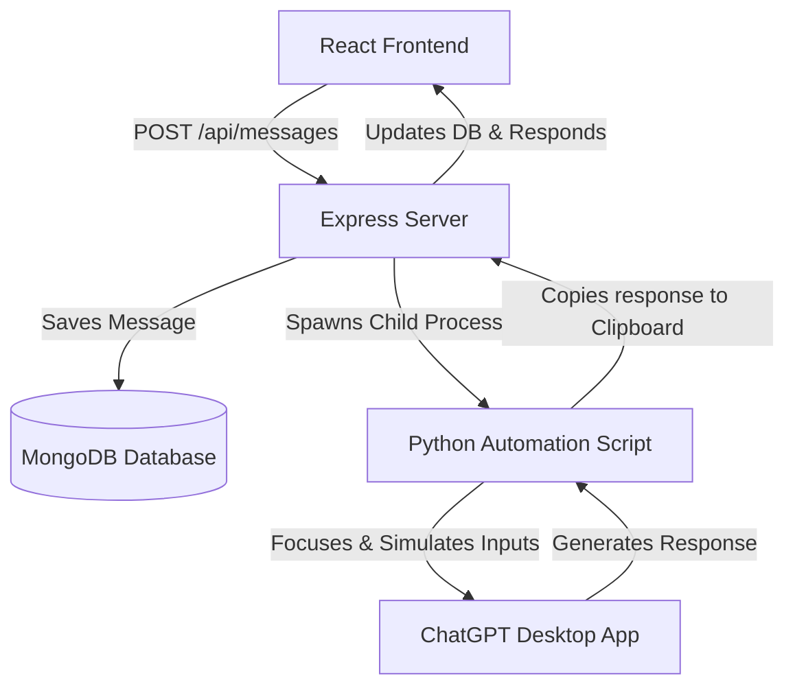

# Implementation Plan: MERN Web App to GPT Desktop Automation

This plan outlines the creation of a MERN-based web application combined with a local Python automation script. The application allows users to send messages from a web interface, which are programmatically entered into the local ChatGPT Desktop app on Windows. The automation script then waits for the response, copies it, and sends it back to the web application.

---

## User Review Required

> [!WARNING]
> **Disk Space Error on Host System (`0x80070070`)**
> During environmental checks, the terminal sandbox encountered a "disk full" error. This prevents us from executing command-line tasks (like running `npm install` or checking versions). We will create all the necessary code files directly in the workspace, but you will need to run the commands (like `npm install` and starting servers) on your local machine.

> [!IMPORTANT]
> **Desktop GUI Automation Requirements**
> To automate the desktop application, the following conditions must be met:
> 1. **Python 3.x** must be installed on your PC.
> 2. The **ChatGPT Desktop App** (official or third-party) must be open on your desktop.
> 3. We will install the Python packages `pywinauto`, `pyautogui`, and `pyperclip` to automate focusing, pasting, and reading the response.

---

## Open Questions

> [!NOTE]
> Please review these questions and provide your feedback:
> 1. **ChatGPT Window Title**: When you open your ChatGPT Desktop app, what is the exact title shown in the taskbar or title bar? (Usually, it is `"ChatGPT"`).
> 2. **MongoDB Database**: Would you prefer using a local MongoDB instance (`mongodb://localhost:27017/gpt_auth`), or would you like to use a MongoDB Atlas cloud URI?
> 3. **Copy Method**: In the ChatGPT Desktop app, is there a keyboard shortcut to copy the last message on your system? (For example, pressing `Tab` or clicking a copy button. We plan to use simulated mouse clicks or keyboard shortcuts like `Ctrl+Shift+C` if supported).

---

## Proposed Changes

We will construct a standard MERN layout under [gpt_auth](file:///d:/pro/gpt_auth).

### Backend Component

We will create a Node.js backend using Express and Mongoose, which also coordinates the execution of the Python automation script.

#### [NEW] [package.json](file:///d:/pro/gpt_auth/package.json) (Root Orchestrator)
A root `package.json` to install dependencies and run both frontend and backend concurrently.

#### [NEW] [package.json](file:///d:/pro/gpt_auth/backend/package.json) (Backend Dependencies)
Defines backend dependencies: `express`, `mongoose`, `cors`, `dotenv`, `nodemon`.

#### [NEW] [server.js](file:///d:/pro/gpt_auth/backend/server.js)
Sets up the Express server:
- Connects to MongoDB database.
- Serves `/api/messages` endpoint (GET to retrieve history, POST to send message and wait for Python automation response).
- Uses `child_process.spawn` to trigger the Python script with the prompt.

#### [NEW] [db.js](file:///d:/pro/gpt_auth/backend/config/db.js)
Handles connection to MongoDB.

#### [NEW] [Message.js](file:///d:/pro/gpt_auth/backend/models/Message.js)
Defines the Mongoose Schema for saving chat messages:
- `text` (String)
- `sender` ('user' | 'gpt')
- `timestamp` (Date)
- `status` ('pending' | 'success' | 'failed')

#### [NEW] [automate.py](file:///d:/pro/gpt_auth/backend/scripts/automate.py)
The Python GUI automation script:
- Connects to the ChatGPT desktop window using `pywinauto`.
- Brings the window to the foreground.
- Copies the prompt into the clipboard using `pyperclip` and pastes it using `Ctrl+V` (more reliable than typing letter-by-letter).
- Presses `Enter` to send.
- Waits for the response to complete. (It will monitor screen or use a configurable timeout, then trigger keyboard navigation or a click to copy the response from ChatGPT desktop).
- Returns the copied response back to the Node backend via stdout.

---

### Frontend Component

A React application styled with vanilla CSS implementing a beautiful, glassmorphic dark-mode chat interface with micro-animations and connection status indicators.

#### [NEW] [package.json](file:///d:/pro/gpt_auth/frontend/package.json)
React with Vite and essential dev dependencies.

#### [NEW] [index.html](file:///d:/pro/gpt_auth/frontend/index.html)
Main HTML entrypoint with customized title and SEO tags.

#### [NEW] [main.jsx](file:///d:/pro/gpt_auth/frontend/src/main.jsx)
React DOM bootstrap file.

#### [NEW] [index.css](file:///d:/pro/gpt_auth/frontend/src/index.css)
CSS file defining variables, scrollbars, modern glassmorphism, responsive chat bubbles, and glowing effects.

#### [NEW] [App.jsx](file:///d:/pro/gpt_auth/frontend/src/App.jsx)
Main App component rendering the chat console:
- Chat bubbles.
- Typing indicator.
- Send form.
- Live status indicator (e.g. "Ready", "Pasting to Desktop...", "GPT Typing...").

---

## Verification Plan

### Automated Tests
Since the GUI automation relies on external desktop states, verification is manual. We will provide a diagnostic script `test_automation.py` to test focusing and pasting to the desktop app independently of the Express server.

### Manual Verification
1. Open the ChatGPT Desktop Application.
2. Run MongoDB locally or set up Atlas.
3. Start the backend: `npm run dev:backend`
4. Start the React frontend: `npm run dev:frontend`
5. Open the web app page in the browser.
6. Type a message and hit "Send".
7. Observe if the ChatGPT Desktop window gets focused, the text gets pasted and sent, and the response is extracted and sent back to the React UI.
