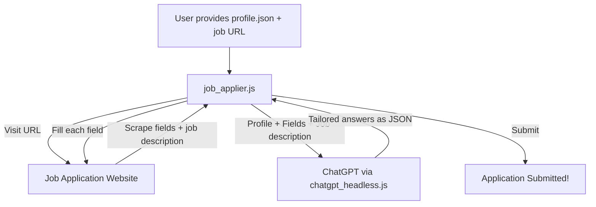

# Implementation Plan: Job Application Automation

## What We Are Building

An automated job application bot that:
1. **Reads your personal profile** (name, email, resume, skills, etc.) from a local JSON file
2. **Visits any job application page URL** you provide
3. **Scrapes all form fields + job description** from that page
4. **Asks ChatGPT** to generate the perfect answer for each field based on your profile and the job
5. **Fills and submits** the form automatically using Playwright

---

## Architecture



---

## Files To Create

### 1. `backend/data/profile.json`
Your private personal information stored locally:
- Full name, email, phone, location
- LinkedIn URL, GitHub URL, portfolio website
- Full resume text (paste in as a string)
- Skills list, years of experience, desired salary
- Cover letter preferences

### 2. `backend/scripts/job_applier.js`
The main automation script:
- **`scrapeJobPage(url)`**: Visits the URL, extracts the job description and all visible form fields (labels, types, dropdowns, etc.)
- **`buildGPTPrompt(profile, jobInfo)`**: Constructs a detailed prompt asking ChatGPT to return a JSON object mapping each field label to the correct answer
- **`fillForm(page, answers)`**: Loops through each form field, finds it on the page, fills it with GPT's answer, handles inputs/textareas/dropdowns/checkboxes
- **`applyToJob(url)`**: Orchestrates the whole flow with a dry-run preview mode

### 3. `backend/scripts/apply_cli.js`
Simple CLI wrapper:
```
node apply_cli.js "https://company.com/careers/apply/1234"
```

---

## Features

| Feature | Details |
|---------|---------|
| **Smart field detection** | Scrapes `label`, `placeholder`, `name`, `aria-label` from all inputs |
| **Dry-run mode** | Shows what GPT would fill in WITHOUT actually submitting, so you can review |
| **Cover letter generation** | GPT writes a custom cover letter tailored to the specific job description |
| **Multi-page forms** | Handles paginated applications (Next button detection) |
| **File upload** | Handles resume PDF upload if the page has a file input |
| **Screenshot on submit** | Captures a screenshot as confirmation of the submitted form |

---

## Open Questions

> [!IMPORTANT]
> **Before we start building, answer these:**
> 1. Should the bot **auto-submit** the form, or show a preview for your approval first? (Dry-run → Approve → Submit is safer)
> 2. Do you want this in the **MERN web UI** (paste URL → click Apply), or just a **CLI command** for now?
> 3. Do you have a **resume PDF file** path, or should we use the resume as plain text only?

---

## Limitations / Notes

> [!WARNING]
> - **Some company portals** (Workday, Greenhouse, Lever, ATS systems) use heavy JavaScript rendering or CAPTCHA. Most simpler career pages will work fine.
> - This is for **applying to companies with career pages that have HTML forms**. Job boards like LinkedIn / Indeed have their own apply flows that are more complex.
> - The profile data stays **100% local** on your machine in `profile.json`. Nothing is sent to any server except your own ChatGPT session.
